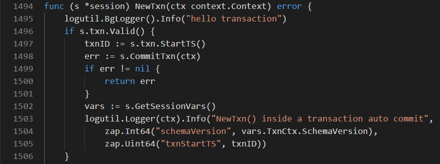

# 准备环境

## 1.编译TiKV

```shell
cd /root/data/tidb/src/github.com/pingcap
git clone https://github.com/tikv/tikv.git
cd tikv
# Future instructions assume you are in this directory
rustup component add rustfmt
rustup component add clippy
make build
```

## 2.编译TiDB


```shell
cd /root/data/tidb/src/github.com/pingcap
git clone https://github.com/pingcap/tidb.git
cd tidb
export GOPROXY=https://mirrors.aliyun.com/goproxy/
make
```


## 3.编译PD


```shell
cd /root/data/tidb/src/github.com/pingcap
git clone https://github.com/pingcap/pd.git
cd pd
export GOPROXY=https://mirrors.aliyun.com/goproxy/
make
```


# 启动

将tidb,pd,tikv编译后生成的可执行程序`pd-server,tikv-server,tidb-server`复制到`/root/data/tidb/bin`。

1.启动顺序

1.PD
2.TiKV
3.TiDB

进入bin目录

```shell
cd /root/data/tidb/bin
```

2.启动PD

```
./pd-server
```

3.启动TiKV

```
#启动第一台
./tikv-server --addr 127.0.0.1:10927 --status-addr 127.0.0.1:20181  --labels host="tikv1" 
#启动第二台
./tikv-server --addr 127.0.0.1:10928 --status-addr 127.0.0.1:20182  --labels host="tikv2" --data-dir=db2
#启动第三台
./tikv-server --addr 127.0.0.1:10929 --status-addr 127.0.0.1:20183  --labels host="tikv3" --data-dir=db3
```

4.启动TiDB

```
./tidb-server --advertise-address=10.204.246.196  --store=tikv --path=127.0.0.1:2379
```

5.访问TiDB数据库

```shell
mysql --host 127.0.0.1 --port 4000 -u root
#####
Welcome to the MySQL monitor.  Commands end with ; or \g.
Your MySQL connection id is 1
Server version: 5.7.25-TiDB-v4.0.0-beta.2-960-g5184a0d70 TiDB Server (Apache License 2.0) Community Edition, MySQL 5.7 compatible

Copyright (c) 2000, 2019, Oracle and/or its affiliates. All rights reserved.

Oracle is a registered trademark of Oracle Corporation and/or its
affiliates. Other names may be trademarks of their respective
owners.

Type 'help;' or '\h' for help. Type '\c' to clear the current input statement.
```

6.检查集群

进入交互模式

```
./pd-ctl -i 

» store
{
  "count": 3,
  "stores": [
    {
      "store": {
        "id": 1,
        "address": "127.0.0.1:10927",
        "labels": [
          {
            "key": "host",
            "value": "tikv1"
          }
        ],
        "version": "4.1.0-alpha",
        "status_address": "127.0.0.1:20181",
        "git_hash": "ae7a6ecee6e3367da016df0293a9ffe9cc2b5705",
        "start_timestamp": 1597532349,
        "deploy_path": "/root/data/tidb/bin",
        "last_heartbeat": 1597541630901730391,
        "state_name": "Up"
      },
      "status": {
        "capacity": "35.03GiB",
        "available": "12.02GiB",
        "used_size": "32.76MiB",
        "leader_count": 14,
        "leader_weight": 1,
        "leader_score": 14,
        "leader_size": 14,
        "region_count": 22,
        "region_weight": 1,
        "region_score": 22,
        "region_size": 22,
        "start_ts": "2020-08-15T19:59:09-03:00",
        "last_heartbeat_ts": "2020-08-15T22:33:50.901730391-03:00",
        "uptime": "2h34m41.901730391s"
      }
    },
    {
      "store": {
        "id": 4,
        "address": "127.0.0.1:10928",
        "labels": [
          {
            "key": "host",
            "value": "tikv2"
          }
        ],
        "version": "4.1.0-alpha",
        "status_address": "127.0.0.1:20182",
        "git_hash": "ae7a6ecee6e3367da016df0293a9ffe9cc2b5705",
        "start_timestamp": 1597532385,
        "deploy_path": "/root/data/tidb/bin",
        "last_heartbeat": 1597541627034611795,
        "state_name": "Up"
      },
      "status": {
        "capacity": "35.03GiB",
        "available": "12.02GiB",
        "used_size": "32.75MiB",
        "leader_count": 4,
        "leader_weight": 1,
        "leader_score": 4,
        "leader_size": 4,
        "region_count": 22,
        "region_weight": 1,
        "region_score": 22,
        "region_size": 22,
        "start_ts": "2020-08-15T19:59:45-03:00",
        "last_heartbeat_ts": "2020-08-15T22:33:47.034611795-03:00",
        "uptime": "2h34m2.034611795s"
      }
    },
    {
      "store": {
        "id": 6,
        "address": "127.0.0.1:10929",
        "labels": [
          {
            "key": "host",
            "value": "tikv3"
          }
        ],
        "version": "4.1.0-alpha",
        "status_address": "127.0.0.1:20183",
        "git_hash": "ae7a6ecee6e3367da016df0293a9ffe9cc2b5705",
        "start_timestamp": 1597532403,
        "deploy_path": "/root/data/tidb/bin",
        "last_heartbeat": 1597541625320647249,
        "state_name": "Up"
      },
      "status": {
        "capacity": "35.03GiB",
        "available": "12.02GiB",
        "used_size": "32.75MiB",
        "leader_count": 4,
        "leader_weight": 1,
        "leader_score": 4,
        "leader_size": 4,
        "region_count": 22,
        "region_weight": 1,
        "region_score": 22,
        "region_size": 22,
        "start_ts": "2020-08-15T20:00:03-03:00",
        "last_heartbeat_ts": "2020-08-15T22:33:45.320647249-03:00",
        "uptime": "2h33m42.320647249s"
      }
    }
  ]
}


```

# 打印日志
在 tidb/session/session.go 文件中 NexTxn()函数添加如下语句：

```
logutil.BgLogger().Info("hello transaction")
```



```
[2020/08/15 22:11:40.513 +09:00] [INFO] [session.go:1495] ["hello transaction"]
[2020/08/15 22:11:40.525 +09:00] [INFO] [session.go:1495] ["hello transaction"]
[2020/08/15 22:11:40.536 +09:00] [INFO] [session.go:1495] ["hello transaction"]
[2020/08/15 22:11:40.539 +09:00] [INFO] [session.go:1495] ["hello transaction"]
```